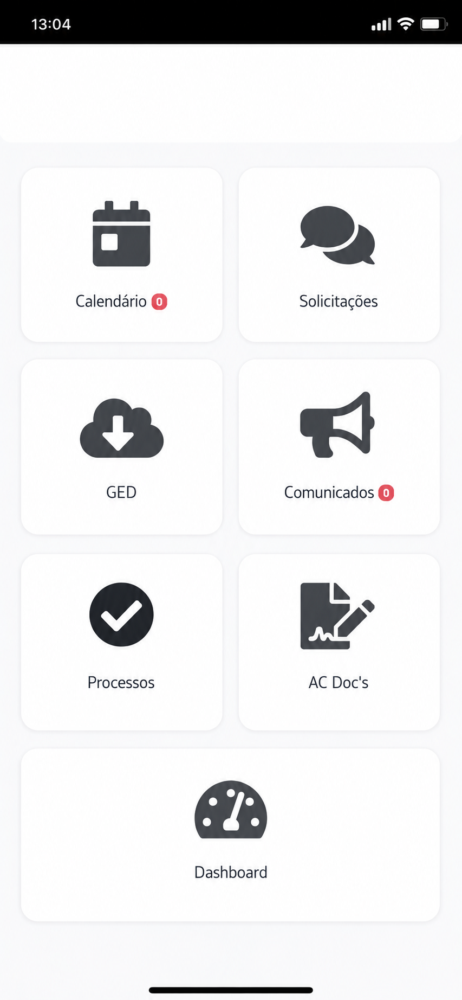

# CONTEC - Escritório de Contabilidade e Consultoria



Uma landing page premium, interativa e altamente otimizada para o escritório de contabilidade CONTEC, especializado no setor de construção civil, incorporações e loteamentos na região de Ibitinga - SP.

## 🌟 Funcionalidades

- **Design Premium B2B:** Estética moderna, usando tipografia clara e gradientes sofisticados para transmitir segurança corporativa.
- **Micro-interações:** Animações com Framer Motion (fade-up, contadores estáticos e scroll progress bar).
- **Modais e Componentes Dinâmicos:** Cards interativos que exibem detalhes dos serviços em modais, além de um acordeão fluido (FAQ).
- **Acessibilidade Completa (WCAG):** Controles com `aria-label`, suporte à navegação sem mouse e contrastes revisados.
- **SEO Avançado:** Meta tags completas, Open Graph para redes sociais, Twitter Cards, e dados estruturados Schema.org para buscas locais.
- **Performance:** Imagens otimizadas (`loading="lazy"`) e hospedagem configurada para máxima velocidade (PWA-ready layout).

## 💻 Tecnologias Utilizadas

- **Core:** React 19 + Vite
- **Estilização:** Tailwind CSS (Vanilla)
- **Animações:** Framer Motion
- **Ícones:** Lucide React & React Icons
- **Infra/Deploy:** Netlify (com headers de segurança)

## 🚀 Instalação e Execução

Siga os passos abaixo para rodar o projeto na sua máquina:

1. **Clone o repositório**
   ```bash
   git clone https://github.com/seu-usuario/contecibitinga.git
   cd contecibitinga
   ```

2. **Instale as dependências**
   Recomendamos usar o `npm`:
   ```bash
   npm install
   ```

3. **Inicie o servidor de desenvolvimento**
   ```bash
   npm run dev
   ```
   Acesse no navegador: `http://localhost:5173/`

4. **Build para Produção**
   ```bash
   npm run build
   ```

## 📂 Estrutura do Projeto

- `/public`: Assets estáticos (imagens em alto tamanho, robots.txt, sitemap.xml, favicon).
- `/src/assets`: Logos e imagens do herói (hero sections).
- `/src/App.jsx`: Componente principal que engloba a Single Page Application e animações.
- `/src/index.css`: Tailwind directives e estilos globais simples.
- `/netlify.toml`: Arquivo de configuração de roteamento SPA e segurança para a Vercel/Netlify.

## 📈 SEO e Performance (Melhorias Aplicadas)

- **SEO:** Inclusão de `robots.txt` para rastreamento adequado, `sitemap.xml`, Canonical Tags e tags Open Graph para WhatsApp e LinkedIn.
- **Performance:** Os componentes do Hero (logo) e demais imagens críticas rodam rápido; depoimentos e modais foram componentizados no React para evitar renderizações excessivas (`DRY`).

## 🛡️ Segurança

Foi incluído um `netlify.toml` que instrui o navegador a usar políticas severas para iframes, inibição de injeção de XSS e bloqueio de "sniff" de MIME type.

## 📱 Responsividade

Todo o projeto utiliza classes utilitárias do Tailwind para breakpoints (`md`, `lg`, `sm`). Modais, menu hambúrguer e formulários foram testados para oferecer touch-targets adequados em dispositivos móveis.

---

### Capturas de Tela 📸
*Nota para o mantenedor:* Adicione as capturas de tela finais nestes caminhos, substituindo se necessário na pasta de assets:
- **Desktop View:** `public/app.png`
- **Mobile View:** `(Requer adição)`

---

## 👤 Autor

**[Jonhy]**
- LinkedIn: [Seu LinkedIn]
- GitHub: [Seu GitHub]

## 📝 Licença

Este projeto é protegido pela **MIT License**. Para mais detalhes, veja o arquivo [LICENSE](LICENSE).
